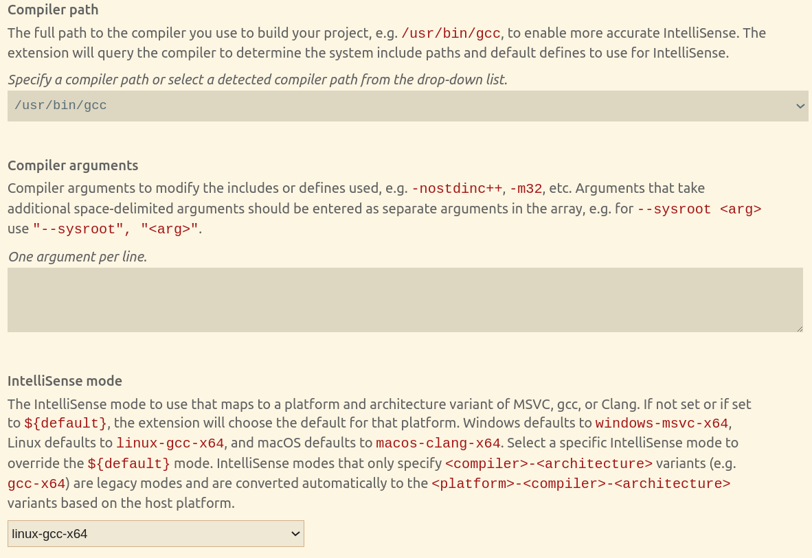
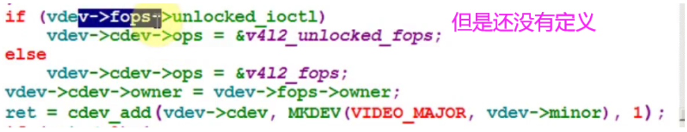
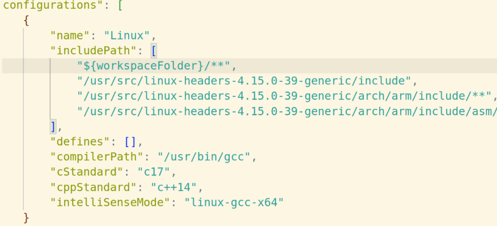
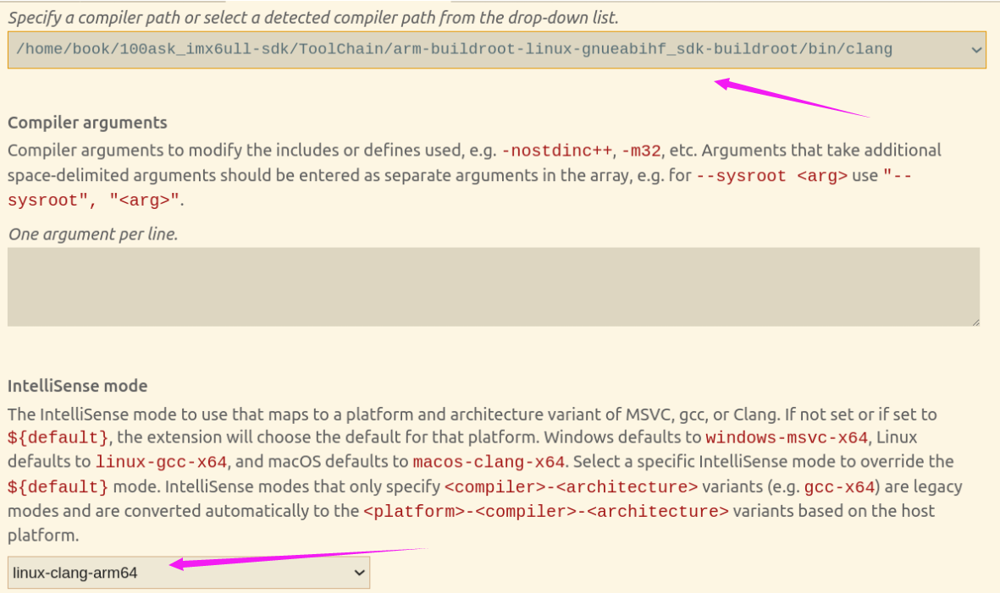

记录写完最简单的虚拟摄像头make过程中的问题：

- `fatal error: asm/bitsperlong.h: No such file or directory`

**步骤一**当前是要编译一个 X86 端运行的内核模块，但在编译日志中出现了 arm 相关字段，因此应该是 ARCH 和CROSS_COMPILE 设置的不对。
经过检查，发现在 ~/.bashrc 文件中将 ARCH 和 CROSS_COMPILE 配置成了 ARM 开发板的编译选项。将该配置去掉之后，问题消失，编译通过。修改后记得`source ~/.bashrc`

**步骤二**但是如果你是用VS Code编译器还要记得修改编译器路径和生成x86程序的设置。如下图所示
  


其他问题：一开始想着既然是32位的程序、那我直接把驱动安装在开发板上不行吗？（解决完段错误后）可以安装。但是问题是不能通过sudo apt-get install 安装xawtv测试软件，无法进行后续的程序效果。即使下载xawtv源码进行.configure时也碰到错误。所以最后放弃这个方法了！


-  `insmod: ERROR: could not insert module myvivid.ko: Invalid parameters`

一开始会遇到各种空指针问题（dmesg 发现问题unable to handle kernel NULL pointer）

**有两方面可能的原因**：

一个原因是没有设置`static struct video_device *my_vivid_device`的一些成员。比如release、fops.

（更深层次的原因是`video_register_device()`底层调用v4l2-dev.c的`__video_register_device()`函数）

  
另一个可能原因是：虚拟机版本使用的Linux内核版本太高了！

```shell
 #https://blog.csdn.net/u010608421/article/details/115658479
 #参考上面这个版本切换虚拟机内核的版本！安装成4的内核版本就行、之前是5的总是报错！
 uname -a		 #查看linux内核版本
 KERN_DIR = /usr/src/linux-headers-4.15.0-39-generic  #makefile的路径要和linux内核版本一致
```


-  `Unknown symbol in module`

```shell
 sudo modprobe vivid  #让程序自动装载注册和卸载的一些依赖模块
 ls /dev/video*       #查看设备节点、确保成功
 sudo rmmod vivid     #卸载驱动
 ls /dev/video*       #确认没有设备节点即可
```


- `权限问题及头文件路径设置`

  解决方法：sudo
  

- `备忘`

后续需要交叉编译32位程序记得把.bashrc的注释恢复过来、并且把VS Code编译器相关设置恢复过来（ctrl+shift+p）

  


- `成功现象`

能查看到设备节点 /dev/video0  

运行xawtv报错could not find a suitable videodev（因为没有设置属性）

